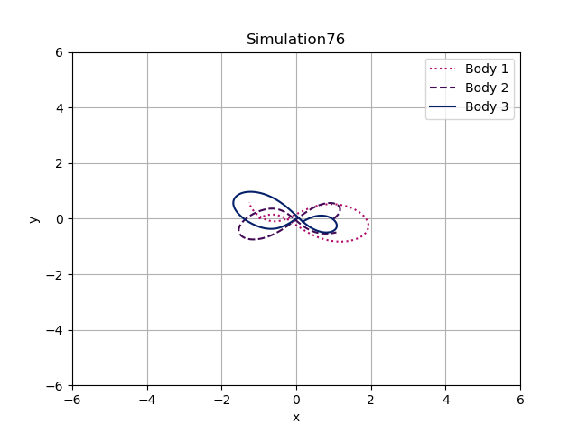

# Solving the three-body problem with a neural network

This is a personal revision of a team practical project done as a part of the undergraduate course Neural Networks
   taught by Prof. Herbert Jaeger at the University of Groningen.
The purpose of the project was to choose, design, implement, test and document 
   an entire pipeline of a machine learning project.
The team consisted of myself and three fellow students: Nea Isla Kauko, Remco Pals, and Andro Erdelez.
We chose to follow one of the Professor's project suggestions inspired by the article from Breen et al. titled
   '_Newton vs the machine: solving the chaotic three-body problem using deep neural networks_'.
Our project was given a grade of 9.08 and was ranked as one of the three best projects in the class.

We attempted to solve the analytically unsolvable three-body problem by training a simple neural network which, 
   given positions and velocities of bodies at time step t, 
   predicted their positions and velocities at the next time step t + 1.
First, a dataset consisting of simulated trajectories of the three bodies in two dimensions was created 
   with a second order ordinary differential equations (ODE) solver. 
Our dataset was preprocessed by stopping simulations when one of the bodies crossed a position threshold
   and by normalizing the positions and velocities of the bodies.
An example of a simulation can be seen below.
Then, the hyperparameters of our multilayer perceptron (MLP) were tuned
   by training and validation of the model on the dataset following a k-fold cross validation scheme.
Our model was subsequently trained on the full dataset and used to recursively predict trajectories 
   many time steps ahead from the initial conditions of the test dataset.
The performance of our model was then evaluated with the k-fold cross validation loss means and standard deviations
   as well as trajectory plots and mean absolute errors of the predicted and true trajectories from the test dataset.
Finally, we discussed and drew conclusions about our entire pipeline 
   and gave suggestions for improvements and extensions.

